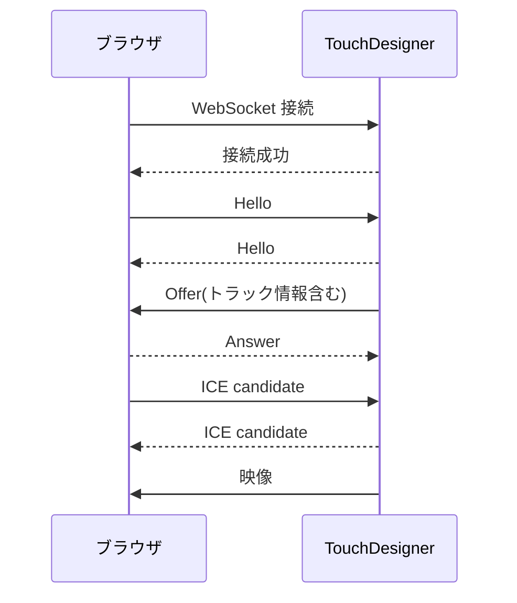

この記事は[TouchDesigner Advent Calendar 2025](https://qiita.com/advent-calendar/2025/touchdesigner)の6日目の記事です。

前日は、くりーぱーさんの[TouchDesigner で Open Media Transport (OMT) を使ってみる](https://qiita.com/Kuripa_chan/items/6f77e57fd624cf711453)でした。
大学の同じサークルの仲間で、記事を書くように焚き付けました(?)。
カスタムOP、夢がありますね。
私も挑戦してみたいです。

こんにちは、Yちゃんです。

皆さんはTouchDesignerというソフトをご存知ですか？
TouchDesignerは、映像を制作したり、VJをしたり、ビジュアルプログラミングためのソフトウェアです。
私は[電気通信大学 バーチャルライブ研究会](https://x.com/uec_VL_Lab)に所属していますが、
ライブの実施に当たって、一部でTouchDesignerを使用しています。

そこでTouchDesignerを知ったわけですが、そこからいろんな活用法を知るようになり、今に至ります。

最近VJをするためにTouchDesignerでプロジェクトを作っていたのですが、
TouchDesignerはUIを組むのが死ぬほどだるい(UIの配置がXY座標という部分がめんどくさい)ので、
GUIを自由に組みやすいWebに頼りたいと考えていました。

実際、今回のTouchDesigner Advent Calendarを立ち上げている[monoton](https://x.com/monoton_music)さんは、
Electronを使ってUIを組んでいらっしゃいます。
toxとかまでWeb UI上で制御できるのはすごいですよね。
(どういう仕組みかいまいち理解できなくて真似できない)

import Twitter from '@/components/Twitter.astro'

<Twitter url="https://x.com/monoton_music/status/1944711722826072375" />

とはいえプレビューとかの映像がブラウザから見れる必要があると思っていて、
そこをなんとかしたいと考えていたのですが、どうやらTouchDesignerが持つ`Video Stream Out TOP`で送出できる方式は[結構限られていて](https://docs.derivative.ca/Video_Stream_Out_TOP)、
`RTMP`や`SRT`、`RTSP`と`WebRTC`の4つしかありません。
そのうち、ブラウザでそのまま見られる映像を送出できるのは`WebRTC`のみです。

この、WebRTCの仕組みよくわかっておらず、結局VJシステムに組み込むことはできなかったのですが、
最近WebRTCを完全に理解する機会を得て、TouchDesignerと組み合わせることにも成功したので、
今回解説していきます。

## WebRTCとは

主に、スマートフォンやPCのブラウザから、ブラウザのAPIで得たカメラ映像や画面キャプチャ映像などをP2P技術によって双方向で送受信できる仕組みです。
映像と合わせて、音声を送ることも可能です。
多くのブラウザにJavaScript APIとして用意されており、標準として普及してきています。

この、WebRTCのAPIがTouchDesignerにも[WebRTC DAT](https://docs.derivative.ca/WebRTC_DAT)として用意されており、
これを利用して映像や音声を送信したり、受信したりできます。

WebRTCの利用に当たっては、NAT越えと呼ばれる課題があります。
ネットワークの知識があるなら何となく分かるかもしれませんが、多くの通信にNetwork Address Translation(NAT)が噛んでいます。
例えば、家の中にはルーターがあり、通信はそこを経由して出ていきますが、ルーターより内側はLAN、外側はWANと呼ばれます。
LANの中では、ルーターは各デバイスに「プライベートIPアドレス」を付与します。WAN側では、インターネットプロバイダが付与してくれた「グローバルIPアドレス」があります。
LANの中からでもインターネットのアクセスできるように、プライベートIPアドレスとグローバルIPアドレスを相互変換するのがNATです。

NAT超えの技術にはSTUNとTRUNがありますが、今回はローカルホスト内での通信で完結するため、使わないので説明は割愛します。

どちらかというと、今回はP2Pで通信するためにシグナリングという処理を自前で行うため、そちらについて少し詳しく書きます。
今回、シグナリングにはWebSocketを利用します。

シグナリングは、「通信を始めたい」というOfferを送信し、相手がそれに対してAnswerを送信することで、通信を始めることができます。
Offer/Answerには、それぞれ送る映像・音声の情報や数を含める必要があります。
これらを変えた場合、シグナリング(ネゴシエーション)を再度行う必要があります。
Answerの送信が終わると、ICE candidateと呼ばれる、映像・音声の送信に必要な情報を送信します。
これらの情報をもとに、映像・音声の送信が開始されます。

今回の事例では、クライアント(ブラウザ)から、Helloを送り、Helloを返します(正直別にHelloは返さなくてもいい)。
その後、TouchDesignerがトラック(映像)情報を含めたOfferを送信し、クライアントがそれに対してAnswerを送信します。
それらが終わった後、ICEの情報を送信し合い、映像が流れ始めます。
以下に、シグナリングの流れを示します。

<div class="flex justify-center">
<div class="flexjustify-center bg-primary-100 rounded-2xl md:w-[40vw] w-full">

</div>
</div>

## TouchDesignerでの実装

このようにノードを用意します。
役割としては、

- WebServerDAT: Webサーバーを立てて、HTMLを配信しながら、WebSocketを待ち受ける
- WebRTC DAT: WebRTC用
- OpFind DAT: 映像の送信元を探す(複数送りたい場合に使う)
- Text DAT: HTMLを内包
- Video Stream Out TOP: 映像を送出する

という感じです。

import Figure from '@/components/Figure.astro'

<Figure alt="必要なノード一覧" src="td-nodes.png" class="mx-auto md:w-[50vw] w-[90vw]" />

Video Stream Out TOPはModeをWebRTCをにしておき、WebRTCタブでWebRTC DATを入れておきます。
ConnectionやVideo TrackはPythonコード内で設定するので、一旦は不要です。

<Figure alt="Video Stream Out TOPの設定" src="td-video-stream-out-param.png" class="mx-auto md:w-[50vw] w-[90vw]" />

WebServerDATは、9980番ポートで待ち受けます。

<Figure alt="WebServerDATの設定" src="td-web-server-param.png" class="mx-auto md:w-[50vw] w-[90vw]" />

Text DATに設定するHTMLは以下のようにします。
長いので折りたたんであります。

<details>
<summary>HTML</summary>

```html
<!DOCTYPE html>
<html>
<head>
  <meta charset="utf-8">
  <title>Viewer</title>
  <style>
    body { padding: 16px; font-family: sans-serif; }
    .videos {
      display: grid;
      grid-template-columns: repeat(auto-fill, minmax(320px,1fr));
      gap: 8px;
      margin-top: 12px;
    }
    video { width: 100%; background: #000; }
  </style>
</head>
<body>

<h2>Viewer</h2>

<div class="videos" id="videoContainer"></div>

<script>
(function() {
  const WS_URL = "ws://localhost:9980";

  let pc = null;
  let ws = null;

  // 複数のvideo streamが受け取れるようにする
  const receivedStreams = [];
  const videoContainer = document.getElementById("videoContainer");
  const statusEl = document.getElementById("status");

  async function start() {
    pc = new RTCPeerConnection({ iceServers: [] });

    ws = new WebSocket(WS_URL);

    ws.onopen = () => {
      console.log("ws connected");
      ws.send(JSON.stringify({ type: "hello", role: "viewer" }));
    };

    ws.onmessage = async (ev) => {
      try {
        const msg = JSON.parse(ev.data);

        if (msg.type === "offer") {
          await pc.setRemoteDescription({ type: "offer", sdp: msg.sdp });
          const answer = await pc.createAnswer();
          await pc.setLocalDescription(answer);
          ws.send(JSON.stringify(answer));
          statusEl.textContent = "接続中";
          return;
        }

        if (msg.type === "ice") {
          if (msg.candidate) {
            await pc.addIceCandidate(msg.candidate);
          }
          return;
        }
      } catch (e) {
        console.error(e);
      }
    };

    ws.onclose = () => {
      console.log("ws closed, reconnecting...");
      statusEl.textContent = "未接続";

      receivedStreams = [];
      videoContainer.innerHTML = "";

      setTimeout(() => {
        if (!ws || ws.readyState !== WebSocket.OPEN) start();
      }, 200);
    };

    pc.onicecandidate = (e) => {
      if (e.candidate) {
        ws.send(JSON.stringify({ type: "ice", candidate: e.candidate }));
      }
    };

    pc.ontrack = (ev) => {
      const stream = new MediaStream([ev.track]);

      if (!receivedStreams.find(s => s.id === stream.id)) {
        receivedStreams.push(stream);

        const videoEl = document.createElement("video");
        videoEl.autoplay = true;
        videoEl.playsInline = true;
        videoEl.muted = true;
        videoEl.srcObject = stream;

        videoContainer.appendChild(videoEl);
      }
    };
  }

  start();
})();
</script>

</body>
</html>
```
</details>

本来、こういったHTMLを手書きするのはめんどくさいので、
TypeScriptとReactを使って、ビルド時にHTMLを生成するのが良いのですが、
今回は簡単のため、手書きしています。
(と言いながらReact+TypeScriptで書いたものをChatGPTに単一HTMLファイルに変換してもらった)

本番運用する際は、React+TypeScript+Viteのような構成で、`vite-plugin-singlefile`などを使って
単一HTMLファイルを生成するか、
先述のmonotonさんのようにElectronを使ってUIを組むのが良いです。

import URLCardContent from '@/components/URLCard.astro'

<URLCardContent url="https://zenn.dev/tweeteafox300/articles/a39a0626afa627" />


次に、WebServerDATのコールバックDATの内容を示します。
これも折りたたんであります。

やっていることとしては、

- HTTPリクエストを受け取ったときに、HTML(Text DATの内容)を返す
- WebSocketのメッセージを受け取ったときに、メッセージ内容(Hello/Answer/ICE candidate)に合わせて返信を返す
  - Helloが来た際は、WebRTC DATを設定しているVideo Stream Out TOPを探して、その映像を送信するようにする
- WebSocketの接続を切断したときに、WebRTCも停止する

といった感じです。

<details>
<summary>WebServerDATのコールバックDAT</summary>


```python
# me - this DAT.
# webServerDAT - the connected Web Server DAT
# request - A dictionary of the request fields. The dictionary will always contain the below entries, plus any additional entries dependent on the contents of the request
# 		'method' - The HTTP method of the request (ie. 'GET', 'PUT').
# 		'uri' - The client's requested URI path. If there are parameters in the URI then they will be located under the 'pars' key in the request dictionary.
#		'pars' - The query parameters.
# 		'clientAddress' - The client's address.
# 		'serverAddress' - The server's address.
# 		'data' - The data of the HTTP request.
# response - A dictionary defining the response, to be filled in during the request method. Additional fields not specified below can be added (eg. response['content-type'] = 'application/json').
# 		'statusCode' - A valid HTTP status code integer (ie. 200, 401, 404). Default is 404.
# 		'statusReason' - The reason for the above status code being returned (ie. 'Not Found.').
# 		'data' - The data to send back to the client. If displaying a web-page, any HTML would be put here.

import json
import uuid

# return the response dictionary
def onHTTPRequest(webServerDAT, request, response):
	response['statusCode'] = 200 # OK
	response['statusReason'] = 'OK'
	response['data'] = op("text1").text
	return response

def onWebSocketOpen(webServerDAT, client, uri):
	return

def onWebSocketClose(webServerDAT, client):
	connection_id = str(op("videostreamout1").par.webrtcconnection)
	if connection_id == "":
		return
	del mod("webrtc1_callbacks").websocket_clients[connection_id]
	op("webrtc1").closeConnection(connection_id)
	return

def handle_viewer_hello(webServerDAT, client):
	webrtc = op("webrtc1")
	connection_id = webrtc.openConnection()

	mod("webrtc1_callbacks").websocket_clients[connection_id] = client

	for i in range(op("opfind1").numRows):
		if op("opfind1")[i, 1] == "videostreamoutTOP":
			video_stream_out = op(op("opfind1")[i, 0])
			if video_stream_out.par.webrtc == "/project1/webrtc1":
				track_id = str(uuid.uuid4())
				webrtc.addTrack(connection_id, track_id, "video")

				video_stream_out.par.webrtcconnection = connection_id
				video_stream_out.par.webrtcvideotrack = track_id

	webrtc.createOffer(connection_id)

def onWebSocketReceiveText(webServerDAT, client, data):
	msg = json.loads(data)
	if msg["type"] == "hello":
		role = msg["role"]
		assert role == "viewer"
		webServerDAT.webSocketSendText(client, json.dumps({
			"type": "hello",
			"role": role,
		}))
		handle_viewer_hello(webServerDAT, client)
	elif msg["type"] == "answer":
		webrtc = op("webrtc1")
		connection_id = op("videostreamout1").par.webrtcconnection
		webrtc.setRemoteDescription(connection_id, 'answer', msg["sdp"])
	elif msg["type"] == "ice":
		webrtc = op("webrtc1")
		connection_id = op("videostreamout1").par.webrtcconnection
		candidate = msg["candidate"]
		webrtc.addIceCandidate(connection_id, candidate["candidate"], candidate["sdpMLineIndex"], candidate["sdpMid"])
    else:
        raise ValueError(f"Unknown message type: {msg['type']}")

	return

def onWebSocketReceiveBinary(webServerDAT, client, data):
	webServerDAT.webSocketSendBinary(client, data)
	return

def onWebSocketReceivePing(webServerDAT, client, data):
	webServerDAT.webSocketSendPong(client, data=data);
	return

def onWebSocketReceivePong(webServerDAT, client, data):
	return

def onServerStart(webServerDAT):
	return

def onServerStop(webServerDAT):
	return

```

</details>

次に、WebRTC DATのコールバックDATの内容を示します。
これも折りたたんであります。

やっていることとしては、

- createOfferが呼ばれたときに、自身の通信情報を設定し、Offerを送信する
- ICE candidateのやり取り

といった感じです。

<details>
<summary>WebRTC DATのコールバックDAT</summary>

```python
# me - this DAT.
# webrtcDAT - the connected WebRTC DAT
# connectionId - uuid of the connection associated with the callback

import json


websocket_clients = {}

# Triggered after webrtcDAT.createOffer
# This callback should set the local description then pass it on to the remote peer via the signalling server
def onOffer(webrtcDAT, connectionId, localSdp):
	webrtcDAT.setLocalDescription(connectionId, 'offer', localSdp, stereo=False)
	
	websocket_client = websocket_clients.get(connectionId)
	if websocket_client:
		op("webserver1").webSocketSendText(
			websocket_client,
			json.dumps({
				"type": "offer",
				"sdp": localSdp
			})
		)

	# Send localSdp to signalling server
	return

# Triggered after webrtcDAT.createAnswer
# This callback should set the local description then pass it on to the remote peer via the signalling server.
def onAnswer(webrtcDAT, connectionId, localSdp):
	webrtcDAT.setLocalDescription(connectionId, 'answer', localSdp, stereo=False)
	# Send localSdp to signalling server
	return

# Trigged when changes to the connection require negotiation via the signalling server
# Eg. webrtcDAT.addTrack, webrtcDAT.removeTrack 
def onNegotiationNeeded(webrtcDAT, connectionId):
	return

# Triggered when a local ICE candidate is gathered
# Local ICE candidates should be sent to remote peer via the signalling server
def onIceCandidate(webrtcDAT, connectionId, candidate, lineIndex, sdpMid):
	# Send candidate to signalling server
	websocket_client = websocket_clients.get(connectionId)
	if websocket_client is not None:
		op("webserver1").webSocketSendText(
			websocket_client,
			json.dumps({
				"type": "ice",
				"candidate": {
					"candinate": candidate,
					"sdpMLineIndex": lineIndex,
					"sdpMid": sdpMid,
				}
			})
		)
	return

def onIceCandidateError(webrtcDAT, connectionId, errorText):
	return

# Triggered on remote track added
def onTrack(webrtcDAT, connectionId, trackId, type):
	return

# Triggered on remote track removed
def onRemoveTrack(webrtcDAT, connectionId, trackId, type):
	return

# Triggered when data channel is created remotely
def onDataChannel(webrtcDAT, connectionId, channelName):
	return

# Triggered when data channel is opened
def onDataChannelOpen(webrtcDAT, connectionId, channelName):
	return

# Triggered when data channel is closed
def onDataChannelClose(webrtcDAT, connectionId, channelName):
	return

# Triggered on receive data through data channel
def onData(webrtcDAT, connectionId, channelName, data):
	return

def onConnectionStateChange(webrtcDAT, connectionId, newState):
	return

def onSignalingStateChange(webrtcDAT, connectionId, newState):
	return

def onIceConnectionStateChange(webrtcDAT, connectionId, newState):
	return

def onIceGatheringStateChange(webrtcDAT, connectionId, newState):
	return

```

</details>

これで準備は完了です。

## 動作確認

WebServerDATとWebRTC DATをActiveにして、ブラウザで`http://localhost:9980`にアクセスします。
ブラウザ上で、映像が流れていれば成功です。

<Figure alt="WebRTCで映像を受信している様子" src="td-webrtc-demo.mov" class="mx-auto md:w-[40vw] w-[90vw]" />

ちなみに、`webrtc1`DATを出力に設定しているVideo Stream Out TOPを全部配信する仕様になっているので、こんな事もできます。

<Figure alt="複数の映像を配信する様子" src="td-webrtc-multi.png" class="mx-auto w-[90vw]" />

これで、TouchDesignerの操作をブラウザに移行するのが捗りますね。

## まとめ

みんなもTouchDesignerで色々遊ぼう。
あとWebRTCはいいぞ。
